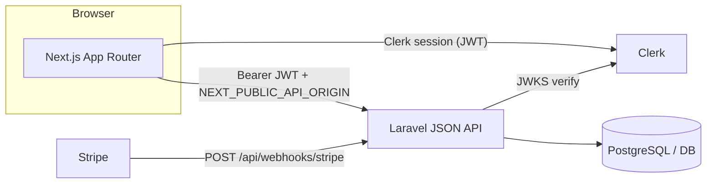

# System architecture (WeSharp MVP)

Bird’s-eye view of how the **browser**, **Next.js frontend**, **Laravel API**, and **Clerk** fit together.

---

## Components

| Layer | Tech | Role |
| --- | --- | --- |
| **SPA** | Next.js 15, React 19, TanStack Query, Tailwind | Marketing site, ops console, route manager PWA-lite, tenant portal |
| **Auth broker** | Clerk | Sign-in UX; JWT **`sub`** maps to Laravel **`users.clerk_user_id`** |
| **API** | Laravel 13, PHP 8.3 | Business rules, permissions, auditing, Stripe webhook endpoint |
| **JSON contract** | `App\Support\ApiResponses` | **`success` / `meta` / `data`** or **`error`** (plus **`validation_error` + `errors`**) |

---

## Request flows (typical)

1. **Tenant reads dashboard** — Browser calls **`GET /api/account/dashboard`** with Clerk Bearer token → **`clerk.auth`** + **`tenant`** (`EnsureTenantCustomer`) → **`AccountDashboardController`**.
2. **Staff updates a knife** — **`POST /api/admin/knives/{id}/mark-sharpened`** → **`staff`** + policy + audited action classes.
3. **Public enquiry** — **`POST /api/public/booking-enquiries`** (throttled), no JWT; persists lead/booking pipeline per **`CreatePublicBookingEnquiryAction`**.

---

## Deployment shape (conceptual)

- **Frontend:** static/SSR on a Node host or Vercel — must receive **`NEXT_PUBLIC_*`** env at build/runtime.
- **Backend:** PHP-FPM or Laravel Octane behind HTTPS — **`APP_URL`**, **`CLERK_*`**, DB, Stripe signing secret.

Operational detail: **`docs/operations/deployment.md`**.

---

## Cross-cutting docs

| Topic | Doc |
| --- | --- |
| Frontend routes & shells | **`docs/architecture/frontend-architecture.md`** |
| Laravel routes & services | **`docs/architecture/backend-architecture.md`** |
| MVP routes & backlog | **`docs/product/mvp-scope.md`** |
